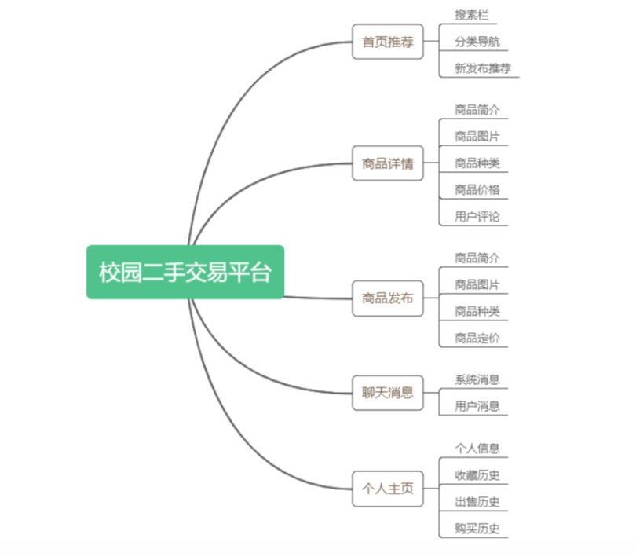
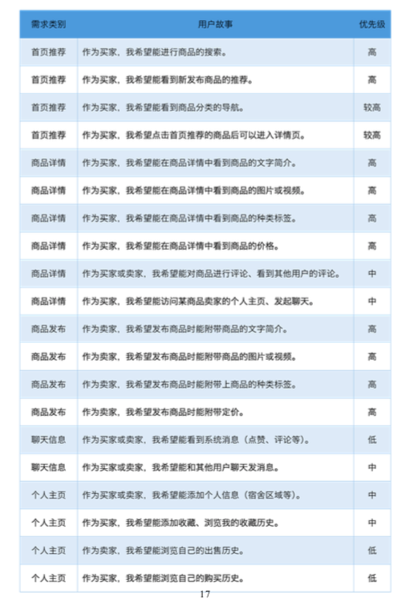

# 基于SSM的校园二手交易平台

## 未实现的功能

1. 购物车支付结算流程、售后评价、给卖家打分、排序。后台管理

2. 展示发布商品点击跳转信息页面（具体信息、加入购物车、结算等）
3. 给卖家、买家留言，聊天功能
4. 个人信息收藏购买出售历史

http://47.101.152.118:8080/

Java版本：1.8   
数据库：MySQL  
框架：Spring + Spring MVC + MyBatis  
服务器：Tomcat  
前端解析框架：Thymeleaf  
开发工具：Idea 2017  
版本管理工具：Maven  
版本控制工具：GitHub  

搭建数据库
MySQL
driver=com.mysql.jdbc.Driver
url=jdbc:mysql://localhost:3306/c2c
username=root
password=123456
initiaSize=0
maxActive=20
maxIdle=20
minIdle=1
maxWait=60000

# 一、设计概要
　　

# 二、设计正文
## 1 需求分析
　　建立一个用户可以自由交易的平台，通过ajax实现局部刷新，实现网站更具人性化，具有更良好的互动。以下是总体需求

### 1.1 通过手机号码注册账号并且登陆
　　每个手机号码只可以注册一个账号，并且通过账号完善个人信息和浏览商品，发布商品等，注册时需要通过手机号码获取验证码进行验证才能注册。
### 1.2 实现二手商城
　　商城主要显示总的商品信息，并且可以通过侧边栏点击进行信息过滤。商品点击之后可以查看详细信息。
### 1.3 站内搜索引擎
　　实现本站内特有的搜索引擎，可以输入字段，模糊查询合适的商品并且显示出来。
### 1.4 求购信息发布
　　根据需求输入相应的信息，发布求购商品。
### 1.5 求购商城
　　卖东西的用户，也可以通过求购商城查看是否有用户对自己拥有的二手物品有需求，查看详细的需求，有的话可以跟买家联系进行交易。
### 1.6 货物出售信息发布
　　卖家可以发布二手商品的信息，对商品进行描述，并且添加图片增加可信度，也方便买家查看相应的信息。
### 1.7 购物车
　　将想要的物品添加到购物车，可以修改数量，选择是否要支付，移除商品。选择收货地址，并且进行结算。
### 1.8 个人信息
　　用户发表求购信息和发布商品时需要先进行信息的完善，用户可以查看自己发布的商品，对发布的商品进行修改或删除，查看已发布求购信息，对求购的商品进行修改或删除。
## 2 概要设计

### 2.1 系统模块
　　本系统的可以分为以下几个模块。
#### 2.1.1 商品首页
　　负责显示热门的商品信息，以及显示本网站的网站信息，导航栏负责跳转到各个页面，没有登录显示按钮可以让用户进行登陆和注册。已登录的用户显示用户名，并且可以发布商品信息，查看个人信息等。进入首页的时候，通过Ajax获取数据库中存在的热门商品数据集合，并且刷新页面的内容，点击商品之后跳转到商品详细信息模块。
#### 2.1.2 二手商城模块
　　负责显示所有的二手商品，提供类别的侧边栏给用户点击之后显示对应的商品信息。类别侧边栏的实现后，需要为每一个类别的元素都添加一个id，通过id来获取数据库中的数据，用Ajax获取数据并且刷新页面的信息。采用分页技术，防止数据过多的时候，显示在同一个页面，给用户带来不好的体验，分页支持点击下一页上一页或者直接点击指定页面，跳转到指定的页面。商品点击之后就要跳转到商品详情。	
#### 2.1.3 商品详情模块
　　负责显示指定的商品详细信息，包括图片、名字、价格、数量等，当一个商品被点击之后，通过返回的id查询到这个数据集合，跳转到商品详细信息的页面，商品发布者可以在下方查看留言，并且与有意者打成交易意向。将对应的信息显示出来，并且提供加入到购物车的功能。商品详细信息下方显示其他用户的留言，并且已经登录的用户可以对这件商品进行评论，商品发布者可以在下方查看留言，并且与有意者打成交易意向。商品发布者可以在下方查看留言，并且与有意者打成交易意向。
#### 2.1.4 站内搜索引擎
　　每一个页面顶部都存在一个搜索输入框，用户通过输入模糊的商品信息，后台数据库通过查询过滤相关的商品信息，并且显示出来给用户查看，显示出来的商品点击之后可以显示商品的详细信息。
#### 2.1.5 发布商品
　　用户输入指定的信息，以及选择商品的图片，之后将这些信息结合当前登陆的用户，通过Ajax发表到后台，并且通过框架存储数据到数据库指定表。
#### 2.1.6 发布求购信息
　　用户输入指定的信息，以及选择商品的图片，之后将这些信息结合当前登陆的用户，通过Ajax发表到后台，并且通过框架存储数据到数据库指定的求购信息表。
#### 2.1.7 个人信息模块
　　显示个人信息，例如用户名、真实姓名、宿舍号、学号等，显示之后还需要支持对于数据进行修改，修改之后，要同步修改页面的信息，这需要用到Ajax进行数据的提交，并且进行页面的局部刷新。
#### 2.1.8 我发布的商品模块
　　显示个人发表的商品信息，支持点击之后对数据进行修改，例如修改商品名字，修改商品的单价和数量等，修改之后将新的数据提交到数据库，数据库执行相应的修改操作，也可以直接下架某件商品，点击删除按钮之后，直接在后台数据库删除这一件商品，并且刷新当前页面上显示的个人发布的商品。给用户带来更好的体验效果。
#### 2.1.9 我发布的求购信息模块
　　显示个人发表的求购商品信息，支持点击之后对数据进行修改，例如修改商品名字，修改商品的单价和数量等，修改之后将新的数据提交到数据库，数据库执行相应的修改操作，也可以直接下架某件商品，点击删除按钮之后，直接在后台数据库删除这一件商品，并且刷新当前页面上显示的个人求购的商品。
#### 2.1.10 购物车模块
　　显示用户加入购物车的商品，计算总的价格，提供全选和取消全选的按钮，从后台获取商品的单价，判断当前剩余的数量，当用户点击数量添加或者减少之后，对于总价要实时刷新，采用jQuery对数据进行修改，当用户取消选中其中的某一个商品，要相应的减少价格并且刷新，提供选择收货地址，对收获地址进行管理，选好收货地址之后，结算购物车，弹出支付页面，让用户选择付款方式，并且提交。
#### 2.1.11 登录注册模块
　　用户通过手机号码和密码进行登录，登录之后显示首页。当用户没有账号的时候，提示用户进行注册，从登录界面切换到注册界面，注册需要通过手机号码获取验证码，后台通过页面传递的手机号码，随机生成4位数的验证码并且缓存，之后通过发送139邮箱的方式发送到指定的手机，手机收取到验证码之后输入验证码提交，判断是否正确，正确则注册成功，失败则注册失败。用户注册完之后直接跳转到首页。

##  2.2 数据结构设计
　　首页需要的数据是热门商品的信息，商品信息需要建立一个Bean对象，存储内容是商品的id、商品名称、商品单价、商品类别、商品数量、商品详细信息、商品成色、商品附带的图片地址、热门程度、发表用户的id、留言的集合，当用户发表之后，保存数据到Bean对象中，并将它存储到数据库。首页请求数据之后，根据热门度返回多个数据，将数据存储到list集合中，并且将它转换为JSON格式数据，返回到页面，页面解析数据并且显示。

　　商场则负责显示所有的商品数据，实现侧边栏点击指定的类别之后，显示对应类别的数据，需要的是类别的id，因此类别Bean对象的数据是类别id、类别名称，点击之后，通过类别id获取到商品详情集合，并且将它转为JSON格式的数据，返回到前端页面，显示数据。

　　点击商品之后，需要显示商品详细信息，通过商品的id返回指定商品的Bean对象，转化为JSON格式的数据，返回到前端页面显示，需要显示商品的留言信息，因此需要留言的Bean对象，包括数据留言id、留言的商品id、留言内容、留言时间，结合商品的详情返回JSON格式数据，前端解析之后显示。

　　求购商城，负责显示所有的求购商品，需要求购商品的Bean，内容包括求购商品id、求购商品名称、求购商品数量、求购商品单价、求购商品详细信息、求购商品留言集合。页面显示时从后台返回对象集合转变的JSON数据，前端解析数据并且显示出来。

　　登陆界面需要验证用户信息，用户信息包括内容用户id、用户名、用户的手机号码、用户密码、用户真实姓名、用户地址、用户email、用户性别、用户学号。验证的时候只需要判断手机号码和密码是否符合，符合则验证通过，返回验证结果，用JSON存储数据。失败则返回失败信息。

　　主要用到的数据结构是ArrayList负责组合各种信息，并且转换为JSON格式数据返回。数据需要排序的时候，用到的是快速排序，负责排列热门商品等的信息，并且返回数据到前端页面进行显示。

# 3 详细设计
## 3.1 数据字典
用户信息表  

| 字段名 |	字段类型|	是否可为空|	备注|
|:------:|:------:|:------:|:------:|
|  Id|	Int(11)	|  否|	主键|
|Modify	|Datetime|	  是|	修改时间|
|Username|	Varchar(50)	 | 否|	用户昵称|
|Phone|	Char(11)|	  否	|  用户手机号码|
|realName|	Varchar(20)	|  是|	  用户真实姓名|
|Clazz|	Varchar(20)	  |是|	  用户所在班级|
|Sno|	Char(12)|	  是|	用户学号|
|Dormitory|	Varchar(20)	|  是|	宿舍号|
|Gender|	Char（2）|	  是|	性别|
|Createtime	|Datetime|	  是|	创建时间|
|Avatar|	Varchar(200)|	  是	| 头像|

用户密码表  

|字段名	|字段类型|	是否可为空|	备注|
|:------:|:------:|:------:|:------:|
|Id|	Int	| 否|	主键|
|Modify	|Datetime|	 是	|修改时间|
|Password|	Varchar(24)	| 否|	用户密码|
|Uid|	Int|	否|	用户id|

## 3.2 实现过程
### 3.2.1 商品首页实现
　　负责显示热门的商品信息，以及显示本网站的网站信息，导航栏负责跳转到各个页面，没有登录显示按钮可以让用户进行登陆和注册。已登录的用户显示用户名，并且可以发布商品信息，查看个人信息等。进入首页的时候，通过Ajax获取数据库中存在的热门商品数据集合，并且刷新页面的内容，点击商品之后跳转到商品详细信息模块。

　　首页的前端设计大体如下

　　顶部实现导航栏，导航栏包括网站logo支持点击之后返回到首页、输入框和按钮负责站内搜索引擎的实现、以及一个span包裹的数据，当有用户登陆时将它替换为用户名，没有用户登录时，则将它设置为登录注册按钮，方便用户进行登录和注册。用户登陆之后，显示出来的用户名可以通过绑定鼠标进入事件，弹出选择框让用户选择相应的操作，例如显示个人信息、查看发布的商品、查看求购的商品、发布商品、发布求购商品信息。导航栏与其他页面共用。

　　显示热门商品信息，采用轮播图实现，主要是先定义一个顶级的div指定position是绝对位置，将除了当前显示的页面之外的轮播图div都隐藏起来，为当前的div添加一个current类，判断点击的方向，如果是右则先获取到current的下一个div，并且将它准备在右侧等候进入，当前的div移出之后，就将下一个进入，并且删除原来的current类，将它添加给新的div。在此过程中控制动画，就可以实现一个精美的轮播图。

　　其他部分实现效果

### 3.2.2 二手商城实现
　　负责显示所有的二手商品，提供类别的侧边栏给用户点击之后显示对应的商品信息。类别侧边栏的实现后，需要为每一个类别的元素都添加一个id，通过id来获取数据库中的数据，用Ajax获取数据并且刷新页面的信息。采用分页技术，防止数据过多的时候，显示在同一个页面，给用户带来不好的体验，分页支持点击下一页上一页或者直接点击指定页面，跳转到指定的页面。商品点击之后就要跳转到商品详情。

　　二手商城前端实现

　　主要是设计侧边栏比较有难度，首先获取后台返回的三级类别，并且将顶级类别显示在侧边栏中，当鼠标移动上去的时候，显示其余两级目录，显示次级目录作为标题，而第三级的目录则是可点击的按钮，点击之后显示相应类别的商品信息。
 
	商城商品展示
 

　　其次是底部分页按钮的实现，左右切换需要通过jQuery来控制，下一页则判断是否已经到达当前显示的页数倒数第二个，如果是就删除第一个页数，并且添加下一页的页数（前提是还有页数可以继续），如果不是倒数第二个，就将当前元素的current类名删除并将它赋给下一个元素。
 
 
### 3.2.3 商品详情实现
　　负责显示指定的商品详细信息，包括图片、名字、价格、数量等，当一个商品被点击之后，通过返回的id查询到这个数据集合，跳转到商品详细信息的页面，商品发布者可以在下方查看留言，并且与有意者打成交易意向。将对应的信息显示出来，并且提供加入到购物车的功能。商品详细信息下方显示其他用户的留言，并且已经登录的用户可以对这件商品进行评论，商品发布者可以在下方查看留言，并且与有意者打成交易意向。商品发布者可以在下方查看留言，并且与有意者打成交易意向。

　　显示商品的详细信息，并且添加可以留言的模块，用户发表留言之后，会在下方的留言板通过ajax进行实时的刷新。

### 3.2.4 站内搜索引擎实现
　　每一个页面顶部都存在一个搜索输入框，用户通过输入模糊的商品信息，后台数据库通过查询过滤相关的商品信息，并且显示出来给用户查看，显示出来的商品点击之后可以显示商品的详细信息。
 
　　搜索结果
3.2.5 发布商品实现

　　用户输入指定的信息，以及选择商品的图片，之后将这些信息结合当前登陆的用户，通过Ajax发表到后台，并且通过框架存储数据到数据库指定表。

　　三级联动的实现，用Ajax获取到三级的类别JSON数据，之后解析JSON数据，将第一级的添加到第一个下拉框，第二级的添加到第二个下拉框，第三级的添加到第三个下拉框，当第一个或者是第二个发生改变的时候，通过获取父容器的子集合修改后两级或者一级的下拉框内容，用jQuery的html替换即可。
 
 

3.2.6 发布求购信息实现

　用户输入指定的信息，以及选择商品的图片，之后将这些信息结合当前登陆的用户，通过Ajax发表到后台，并且通过框架存储数据到数据库指定的求购信息表。三级联动采用前一个的即可。
 
### 3.2.7 个人信息页面实现
　　显示个人信息，例如用户名、真实姓名、宿舍号、学号等，显示之后还需要支持对于数据进行修改，修改之后，要同步修改页面的信息，这需要用到Ajax进行数据的提交，并且进行页面的局部刷新。

　　所有信息采用jQuery的EasyUI中的accordion显示，标题显示信息，而底部内容则显示修改的组件，之后Ajax修改具体信息后需要将对应的新的内容，采用jQuery显示到标题中。
 

### 3.2.8 我发布的商品实现
　　显示个人发表的商品信息，支持点击之后对数据进行修改，例如修改商品名字，修改商品的单价和数量等，修改之后将新的数据提交到数据库，数据库执行相应的修改操作，也可以直接下架某件商品，点击删除按钮之后，直接在后台数据库删除这一件商品，并且刷新当前页面上显示的个人发布的商品。给用户带来更好的体验效果。
 
　　点击修改
 

### 3.2.9我发布的求购信息实现
　　显示个人发表的求购商品信息，支持点击之后对数据进行修改，例如修改商品名字，修改商品的单价和数量等，修改之后将新的数据提交到数据库，数据库执行相应的修改操作，也可以直接下架某件商品，点击删除按钮之后，直接在后台数据库删除这一件商品，并且刷新当前页面上显示的个人求购的商品。

### 3.2.10购物车实现

显示用户加入购物车的商品，计算总的价格，提供全选和取消全选的按钮，从后台获取商品的单价，判断当前剩余的数量，当用户点击数量添加或者减少之后，对于总价要实时刷新，采用jQuery对数据进行修改，当用户取消选中其中的某一个商品，要相应的减少价格并且刷新，提供选择收货地址，对收获地址进行管理，选好收货地址之后，结算购物车，弹出支付页面，让用户选择付款方式，并且提交。

### 3.2.11登录注册实现

　　用户通过手机号码和密码进行登录，登录之后显示首页。当用户没有账号的时候，提示用户进行注册，从登录界面切换到注册界面，注册需要通过手机号码获取验证码，后台通过页面传递的手机号码，随机生成4位数的验证码并且缓存，之后通过发送139邮箱的方式发送到指定的手机，手机收取到验证码之后输入验证码提交，判断是否正确，正确则注册成功，失败则注册失败。用户注册完之后直接跳转到首页。

后台实现的过程  

　　1.	总述：本次后台使用的编程语言为Java，使用的框架是Spring+SpringMVC+Mybatis

  　　2. 后台结构总图

　　3.后台实现了一个只能单用户登录的功能：如果有两个用户使用同一个账号分别登录，那么后一个登录的用户会踢掉第一个用户登录的账号，也就是说先登录的用户会被强制退出。实现细节：主要使用的是websockt和spring websockt。首先前端判断用户有没有登录，如果有登录的话，就将用户的手机号码，当前时间发送到后台，后台接收到信息，解析信息，将信息存储到Map中，前台循环提交这些信息，并判断Map中手机号码对应的时间是否相等，如果不相等，证明有其他用户登录了该账号，后台发送下线信息到前端，前端收到信息后，触发退出当前账号事件。

　　4.常规数据库增删查改：考虑到密码是重要的信息，所以当操作密码的时候，都是先使用MD5对其进行加密后处理。例如修改密码，注册用户等等。各个数据表之间的关联都是通过逻辑处理进行数据联系的。

　　5.防止用户重复提交：在每个界面，都会由后台生成一个token，然后前端页面存储该token，如果用户进行提交按钮等事件时，就会连这个token一起发送到后台进行处理，后台若获取不到token或者token不相匹配，那么就判定该用户重复提交这个事件，后台直接返回原本页面。

　　6.敏感词过滤：管理员将敏感词编入到数据库中，用户发布商品时附带的商品名称，商品备注等等，都会被过滤，将其中的敏感词替代成**。然后返回对应的数值。用户在填写商品名称，详情的时候，还会ajax自动和后台进行验证判断，并实时提醒用户有没有输入敏感词。

### 6.1 首页
　　首先访问本站网址，进入首页，可以浏览首页的商品信息，首页轮播图可以左右切换查看商品信息，如果没有主动切换，那么每3.5s之后会自动往右切换一张，往下滑动显示的是其他的一些热门商品缩略信息，点击商品名字之后可以查看该商品的详细信息和留言。再下方是一些其他信息，可以忽略。
### 6.2 普通游客的限制
　　普通游客可以随意访问首页，可以通过导航栏访问商城，求购商城等。但是如要要发布求购、发布商品则需要先登录。
### 6.3 没有账号？
　　如果用户还没有账号，那么点击右上角的注册按钮，之后会跳转到注册界面，用户需要输入手机号，再通过它获取验证码，注意输入的手机号必须要格式正确并且有效，获取验证码之后，便点击下一步，此时到达的界面是确认密码界面，重复输入密码，两次输入的密码必须一致。确认完毕之后就会进入首页。如果用户忘记了自己注册过的账号密码，那么点击登录界面的忘记密码选项，输入注册时使用的手机号码，通过此手机号码获取验证码，输入验证码之后，点击下一步开始重置密码，重置完毕之后就会重新进入到首页。
### 6.4 商城
　　用户想要查看其他用户发布的商品，需要通过点击导航栏处的商城进入到商城页面，在此可以浏览所有的商品，每页显示12个，底部的分页按钮，可以点击之后切换到用户想找的页面。而用户如果需要过滤信息，找到自己想要的类别，左侧悬浮的悬浮框，鼠标移动到指定的类别中，查看详细的类别，点击自己想要找的商品类别，网站便会过滤出指定的商品呈现给用户。

　　商城显示的商品信息只是一部分，通过点击商品名可以跳转到商品详细信息页面，用户可以在此查看商品的所有信息，可以将它添加到购物车，或者查看下方其他用户的留言，也可以针对自己的意见，对商品做出评价。
### 6.5 模糊查询
　　如果想要模糊查询商品，最顶部有一个输入框，输入商品的信息，点击搜索按钮，系统会自动过滤合适的商品呈现给用户。
### 6.6 求购商城
　　如果用户有商品想要出售，可以进入求购商城，浏览其他用户的求购信息，通过点击顶部的导航栏 求购商城 进入查看所有的求购信息，同样有分页和侧边栏的功能。
### 6.7 发布商品信息
　　如果已经登录过，那么右上角显示的是用户名，将鼠标移动到上面，会弹出一个下拉框，点击发布商品信息，按照提示输入各自的信息，之后确认信息无误之后点击发布按钮即可。
### 6.8 发布求购信息
　　发布求购信息的过程跟发布商品信息一样，主要是点击下拉框的发布求购信息，在发表即可。
### 6.9 查看我发布的商品
　　鼠标移动到左上角的用户名，点击显示出来的下拉框的我发布的商品，就可以进入到自己发布过的商品，可以点击每一个商品下方的修改图标可以对商品进行修改，点击删除图片可以下架这个商品。
### 6.10 查看我的求购商品
　　跟查看我发布的商品基本一致，只是点击的是我的求购商品。
### 6.11 购物车
　　用户浏览到合适的商品，可以点击添加至购物车的按钮，之后可以将鼠标移动至右上角用户名处，点击显示出来的下拉列表，点击我的购物车，进入到我的购物车查看自己有意向购买的商品。此时可以选择收货地址，或者修改购物车中的一些信息，例如修改数量，或者删除某一件商品。也可以同时选中所有的商品，或者是取消选中所有的商品，之后便可以结算。

